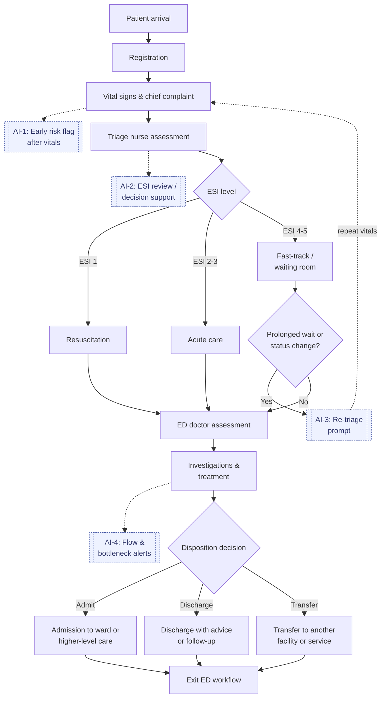

```mermaid
%%{init: {'flowchart': {'nodeSpacing': 14, 'rankSpacing': 20, 'curve': 'basis'}, 'themeVariables': {'fontSize': '13px'}}}%%
flowchart TD
    A[Patient arrival] --> B[Registration]
    B --> C[Vital signs & chief complaint]

    C -.-> P1[["AI-1: Early risk flag<br/>after vitals"]]
    C --> D[Triage nurse assessment]

    D -.-> P2[["AI-2: ESI review /<br/>decision support"]]
    D --> E{ESI level}

    E -->|ESI 1| F[Resuscitation]
    E -->|ESI 2-3| G[Acute care]
    E -->|ESI 4-5| H[Fast-track /<br/>waiting room]

    H --> I{Prolonged wait or<br/>status change?}
    I -->|Yes| P3[["AI-3: Re-triage<br/>prompt"]]
    I -->|No| J[ED doctor assessment]

    F --> J
    G --> J

    J --> K[Investigations &<br/>treatment]
    K -.-> P4[["AI-4: Flow &<br/>bottleneck alerts"]]
    K --> L{Disposition decision}

    L -->|Admit| M[Admission to ward or<br/>higher-level care]
    L -->|Discharge| N[Discharge with advice<br/>or follow-up]
    L -->|Transfer| O[Transfer to another<br/>facility or service]

    M --> Q[Exit ED workflow]
    N --> Q
    O --> Q

    P3 -.->|repeat vitals| C

    classDef ai fill:#eef2ff,stroke:#5b6bb0,stroke-dasharray: 2 2,color:#33396b;
    class P1,P2,P3,P4 ai;
```
