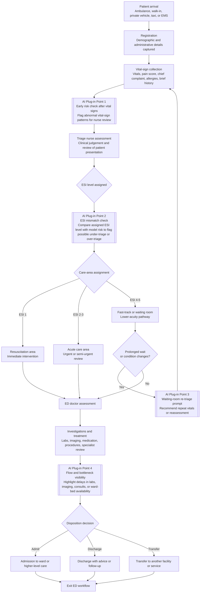

```mermaid
flowchart TD

A["Patient arrival<br/>Ambulance, walk-in, private vehicle, taxi, or EMS"] --> B["Registration<br/>Demographic and administrative details captured"]

B --> C["Vital-sign collection<br/>Vitals, pain score, chief complaint, allergies, brief history"]

C --> P1[["AI Plug-in Point 1<br/>Early risk check after vital signs<br/>Flag abnormal vital-sign patterns for nurse review"]]

P1 --> D["Triage nurse assessment<br/>Clinical judgement and review of patient presentation"]

D --> E{"ESI level assigned"}

E --> P2[["AI Plug-in Point 2<br/>ESI mismatch check<br/>Compare assigned ESI level with model risk to flag possible under-triage or over-triage"]]

P2 --> F{"Care-area assignment"}

F -->|ESI 1| G["Resuscitation area<br/>Immediate intervention"]

F -->|ESI 2-3| H["Acute care area<br/>Urgent or semi-urgent review"]

F -->|ESI 4-5| I["Fast-track or waiting room<br/>Lower-acuity pathway"]

I --> J{"Prolonged wait<br/>or condition changes?"}

J -->|Yes| P3[["AI Plug-in Point 3<br/>Waiting-room re-triage prompt<br/>Recommend repeat vitals or reassessment"]]

P3 --> C

J -->|No| K["ED doctor assessment"]

G --> K

H --> K

K --> L["Investigations and treatment<br/>Labs, imaging, medication, procedures, specialist review"]

L --> P4[["AI Plug-in Point 4<br/>Flow and bottleneck visibility<br/>Highlight delays in labs, imaging, consults, or ward-bed availability"]]

P4 --> M{"Disposition decision"}

M -->|Admit| N["Admission to ward or higher-level care"]

M -->|Discharge| O["Discharge with advice or follow-up"]

M -->|Transfer| R["Transfer to another facility or service"]

N --> S["Exit ED workflow"]

O --> S

R --> S
```
