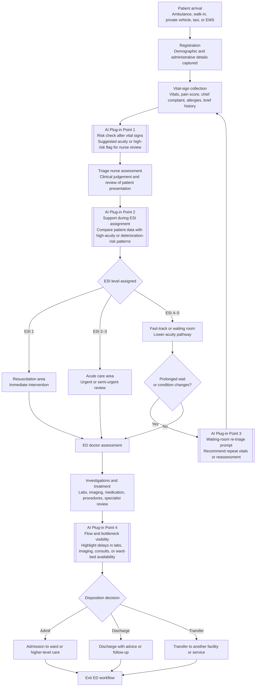

```mermaid
flowchart TD

A[Patient arrival<br/>Ambulance, walk-in, private vehicle, taxi, or EMS] --> B[Registration<br/>Demographic and administrative details captured]

B --> C[Vital-sign collection<br/>Vitals, pain score, chief complaint, allergies, brief history]

C --> P1[[AI Plug-in Point 1<br/>Risk check after vital signs<br/>Suggested acuity or high-risk flag for nurse review]]

P1 --> D[Triage nurse assessment<br/>Clinical judgement and review of patient presentation]

D --> P2[[AI Plug-in Point 2<br/>Support during ESI assignment<br/>Compare patient data with high-acuity or deterioration-risk patterns]]

P2 --> E{ESI level assigned}

E -->|ESI 1| F[Resuscitation area<br/>Immediate intervention]
E -->|ESI 2–3| G[Acute care area<br/>Urgent or semi-urgent review]
E -->|ESI 4–5| H[Fast-track or waiting room<br/>Lower-acuity pathway]

H --> I{Prolonged wait<br/>or condition changes?}

I -->|Yes| P3[[AI Plug-in Point 3<br/>Waiting-room re-triage prompt<br/>Recommend repeat vitals or reassessment]]
P3 --> C

I -->|No| J[ED doctor assessment]

F --> J
G --> J

J --> K[Investigations and treatment<br/>Labs, imaging, medication, procedures, specialist review]

K --> P4[[AI Plug-in Point 4<br/>Flow and bottleneck visibility<br/>Highlight delays in labs, imaging, consults, or ward-bed availability]]

P4 --> L{Disposition decision}

L -->|Admit| M[Admission to ward or higher-level care]
L -->|Discharge| N[Discharge with advice or follow-up]
L -->|Transfer| O[Transfer to another facility or service]

M --> Q[Exit ED workflow]
N --> Q
O --> Q
```
