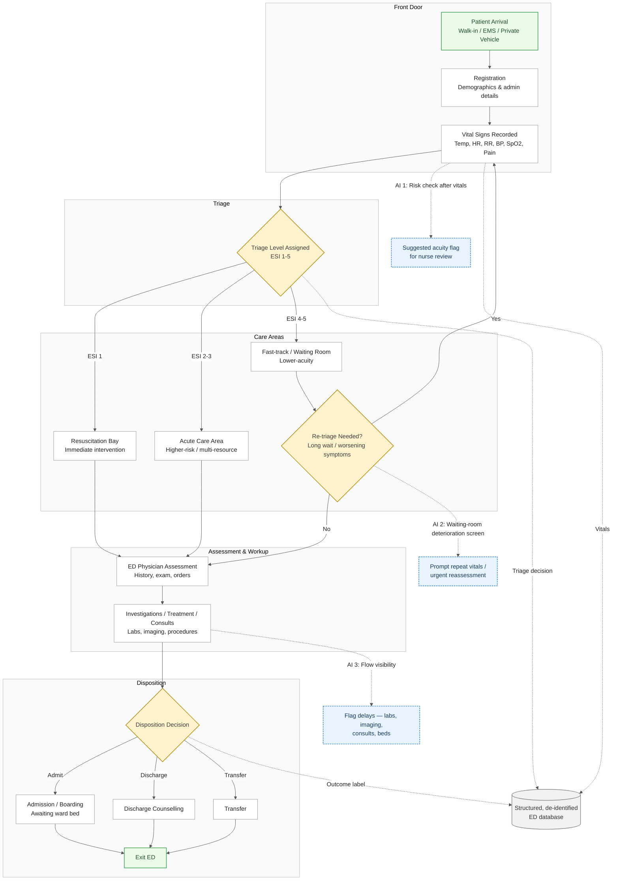

# Week 3 Interim Workflow Diagram

```mermaid
    %%{init: {'theme': 'base', 'themeVariables': {'background':'#ffffff','primaryColor':'#ffffff','primaryTextColor':'#222222','primaryBorderColor':'#999999','lineColor':'#555555','textColor':'#222222','clusterBkg':'#fafafa','clusterBorder':'#bbbbbb'}}}%%
flowchart TD
    subgraph FrontDoor["Front Door"]
        A[Patient Arrival<br/>Walk-in / EMS / Private Vehicle]
        B[Registration<br/>Demographics &amp; admin details]
        C[Vital Signs Recorded<br/>Temp, HR, RR, BP, SpO2, Pain]
    end

    subgraph TriageStage["Triage"]
        D{Triage Level Assigned<br/>ESI 1-5}
    end

    subgraph CareAreas["Care Areas"]
        E[Resuscitation Bay<br/>Immediate intervention]
        F[Acute Care Area<br/>Higher-risk / multi-resource]
        G[Fast-track / Waiting Room<br/>Lower-acuity]
        H{Re-triage Needed?<br/>Long wait / worsening symptoms}
    end

    subgraph Workup["Assessment &amp; Workup"]
        I[ED Physician Assessment<br/>History, exam, orders]
        J[Investigations / Treatment / Consults<br/>Labs, imaging, procedures]
    end

    subgraph Disposition["Disposition"]
        K{Disposition Decision}
        L[Admission / Boarding<br/>Awaiting ward bed]
        M[Discharge Counselling]
        N[Transfer]
        O[Exit ED]
    end

    A --> B --> C --> D
    D -->|ESI 1| E
    D -->|ESI 2-3| F
    D -->|ESI 4-5| G
    G --> H
    H -->|Yes| C
    H -->|No| I
    E --> I
    F --> I
    I --> J --> K
    K -->|Admit| L --> O
    K -->|Discharge| M --> O
    K -->|Transfer| N --> O

    %% AI plug-ins
    C -. "AI 1: Risk check after vitals" .-> P1[Suggested acuity flag<br/>for nurse review]
    H -. "AI 2: Waiting-room deterioration screen" .-> P2[Prompt repeat vitals /<br/>urgent reassessment]
    J -. "AI 3: Flow visibility" .-> P3[Flag delays — labs, imaging,<br/>consults, beds]

    %% Data layer
    C -. Vitals .-> DB[(Structured, de-identified<br/>ED database)]
    D -. Triage decision .-> DB
    K -. Outcome label .-> DB

    classDef decision fill:#fff3cd,stroke:#b38600,stroke-width:1.5px,color:#3d3d3d
    classDef aiNode fill:#e7f3ff,stroke:#2b7cd3,stroke-width:1.5px,color:#1a3a5c,stroke-dasharray: 4 2
    classDef dataNode fill:#f2f2f2,stroke:#888,stroke-width:1.5px,color:#333
    classDef terminal fill:#eafbe7,stroke:#3a9d4f,stroke-width:1.5px,color:#234d2c

    class D,H,K decision
    class P1,P2,P3 aiNode
    class DB dataNode
    class A,O terminal
```
